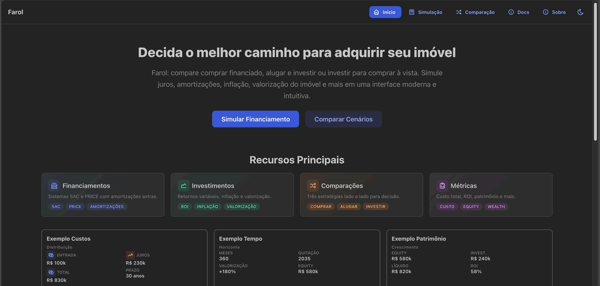

# Farol

Farol é uma plataforma de simulação e planejamento financeiro focada inicialmente em cenários imobiliários no Brasil.

Disponível em: [Aplicação Web](https://farol-web.onrender.com/)

> **Atenção**
> Serviço hospedado em plano gratuito. Por ser instância gratuita, ela será suspensa em caso de inatividade, o que pode atrasar a primeira simulação em 50 segundos ou mais. A estabilidade pode variar sem aviso prévio.

Se preferir rodar localmente, há instruções ao longo deste README.

<details open>
<summary><strong>Comparação de cenários</strong></summary>

&nbsp;


</details>

<details>
<summary><strong>Simular financiamento</strong></summary>

&nbsp;


</details>

## Autor
Wilson Rocha Lacerda Junior – desenvolvedor da biblioteca open source de Aprendizado de Máquina [SysIdentPy](https://github.com/wilsonrljr/sysidentpy).

Redes e contato:
- GitHub: https://github.com/wilsonrljr
- LinkedIn: https://www.linkedin.com/in/wilsonrljr
- ORCID: https://orcid.org/0000-0002-3263-1152

Para conversar: abra uma discussão, issue ou mande um PR. Ideias e feedback são bem-vindos.

## Funcionalidades
- Simulação de financiamentos imobiliários nos sistemas SAC e PRICE.
- Comparação entre diferentes estratégias:
  - Comprar um imóvel com financiamento.
  - Alugar e investir o valor da entrada.
  - Investir até comprar à vista.
- Amortizações extraordinárias configuráveis ao longo do tempo.
 - Amortizações extraordinárias avançadas: eventos únicos, recorrentes, valores fixos ou % do saldo, ajuste opcional por inflação.
- Múltiplas faixas de retorno de investimento (variação temporal).
- Considera inflação, valorização do imóvel, custos adicionais (ITBI, escritura, condomínio, IPTU).
- Resultados detalhados: fluxo de caixa mensal, patrimônio, saldo investido, equity, valor do imóvel.
- Interface web responsiva (React + Mantine).

## Tecnologias
Backend: Python (FastAPI, Pydantic, NumPy, Pandas, Matplotlib)
Frontend: React + Vite + TypeScript + Mantine UI

## Instalação (Dev)
Você pode usar `uv` (recomendado) ou `pip`.

Backend com `uv`:
```bash
uv sync --extra dev
uv run pytest        # opcional
uv run uvicorn backend.app.main:app --reload
```

Backend com `pip`:
```bash
pip install -e .[dev]
pytest -q            # opcional
uvicorn backend.app.main:app --reload
```

Gerar/atualizar lock (cria `uv.lock`):
```bash
uv lock
```

Frontend (em outro terminal):
```bash
cd frontend
npm install
npm run dev
```

Frontend: http://localhost:5173

## Tutorial para quem não sabe programação

Se você só quer USAR o Farol no seu computador (sem aprender programação), siga um dos passo a passo abaixo. Eles usam o Docker para evitar instalações complicadas.

O que você vai fazer? (1) Instalar Docker Desktop, (2) rodar o “cérebro” (backend), (3) rodar a interface (frontend) e (4) abrir o navegador.

<details open>
<summary><strong>Windows (passo a passo)</strong></summary>

&nbsp;

1. (Só uma vez) Ativar o WSL
  - Abra o menu Iniciar, digite: powershell
  - Clique com botão direito: “Executar como administrador”.
  - Digite o comando abaixo e aperte Enter:
    ```bash
    wsl --install
    ```
  - Reinicie o computador se aparecer uma mensagem dizendo que deve reiniciar. Se não aparecer nada, pode fechar.

2. Instalar o Docker Desktop
  - Baixe em: https://www.docker.com/products/docker-desktop/
  - Instale aceitando as opções padrão. Se não quiser cadastrar uma conta, pode clicar na opção "skip" que fica no canto superior direito na tela de cadastro.
  - Abra o Docker Desktop e espere o ícone na barra de tarefas ficar estável (rodando).

3. Abrir um PowerShell normal (não precisa ser admin)
  - Dica: você pode copiar e colar os comandos abaixo.

4. Rodar o backend (cérebro da simulação)
  ```bash
  docker run -d --name farol-backend -p 8000:8000 "wilsonrljr/farol-backend:0.1.0"
  ```

5. Testar se o backend respondeu
  - Abra: http://localhost:8000/docs — se abrir a página interativa, está ok.

6. Rodar o frontend (interface web)
  ```bash
  docker run -d --name farol-frontend -p 8080:80 ^
    -e VITE_API_BASE=http://localhost:8000 ^
    "wilsonrljr/farol-frontend:0.1.1"
  ```
  (No PowerShell o `^` quebra linha. Se preferir, pode colocar tudo em uma linha.)

7. Usar o Farol
  - Acesse: http://localhost:8080

8. Encerrar quando não estiver usando
  ```bash
  docker stop farol-frontend farol-backend
  ```

9. Atualizar para nova versão (quando anunciado)
  Substitua as tags e force baixar de novo:
  ```bash
  docker pull wilsonrljr/farol-backend:0.1.2
  docker pull wilsonrljr/farol-frontend:0.1.2
  docker stop farol-frontend farol-backend 2>$null
  docker rm farol-frontend farol-backend 2>$null
  ```
  Depois repita os passos 4 e 6 com as novas tags.

10. Problemas comuns

| Problema | O que significa | Como resolver |
|----------|-----------------|----------------|
| Página não abre | Frontend ainda iniciando | Aguarde 5–10s e recarregue |
| http://localhost:8000/docs não abre | Backend não subiu | Veja se o Docker Desktop está aberto / tente `docker logs farol-backend` |
| Porta em uso | Já tem algo nas portas 8000/8080 | Troque mapeamento: `-p 8001:8000` e `-p 8081:80` (e use a nova URL) |
| Versão antiga | Imagem cache local | Rode `docker pull ...` das duas imagens e reinicie |
| Erro de rede na simulação | Frontend não acha backend | Confirme a variável `VITE_API_BASE` |
| Mensagem sobre CORS | Navegador bloqueou origem | Abra issue (backend libera origens) |

Pronto: esses são os passos mínimos no Windows.

</details>

<details>
<summary><strong>macOS (passo a passo)</strong></summary>

&nbsp;

Funciona em Intel e Apple Silicon (M1/M2/M3). Versões exemplo:

1. Instalar Docker Desktop
  - Baixe: https://www.docker.com/products/docker-desktop/
  - Arraste para Aplicativos e abra. Conceda permissões se solicitar.

2. Confirmar que o Docker está rodando
  - Ícone da baleia deve aparecer na barra de menus (topo). Espere “Docker is running”.

3. Abrir o Terminal (Spotlight: ⌘ + Espaço → “Terminal”)

4. Rodar backend
  ```bash
  docker run -d --name farol-backend -p 8000:8000 wilsonrljr/farol-backend:0.1.0
  ```

5. Testar backend: abra http://localhost:8000/docs

6. Rodar frontend
  ```bash
  docker run -d --name farol-frontend -p 8080:80 \
    -e VITE_API_BASE=http://localhost:8000 \
    wilsonrljr/farol-frontend:0.1.1
  ```

7. Usar: http://localhost:8080

8. Parar quando terminar
  ```bash
  docker stop farol-frontend farol-backend
  ```

9. Atualizar versões
  ```bash
  docker pull wilsonrljr/farol-backend:0.1.2
  docker pull wilsonrljr/farol-frontend:0.1.2
  docker stop farol-frontend farol-backend 2>/dev/null || true
  docker rm farol-frontend farol-backend 2>/dev/null || true
  ```
  Refaça os passos 4 e 6 com as novas tags.

10. Problemas comuns

| Problema | Significado | Ação |
|----------|-------------|------|
| Página vazia | Frontend iniciando | Aguarde e recarregue |
| Não abre /docs | Backend não subiu | `docker ps` / `docker logs farol-backend` |
| Porta já usada | Outra app usa 8000/8080 | Troque para 8001 / 8081 |
| Versão antiga | Cache local | `docker pull` das imagens |
| Erro rede simulação | Variável API errada | Confirme `VITE_API_BASE` |

Pronto: usando o Farol no macOS.

</details>

---

---

### (Opcional) Uso com Docker Compose
Se preferir orquestrar tudo com Compose (dev com hot reload ou modo produção), as seções abaixo permanecem disponíveis.

### Ambiente de Desenvolvimento (hot reload)
Requisitos: Docker >= 24, Docker Compose Plugin.

Subir (backend com reload + frontend Vite):
```bash
docker compose up --build
```
Endpoints:
- Backend: http://localhost:8000/docs
- Frontend: http://localhost:5173

Parar:
```bash
docker compose down
```

### Ambiente de Produção (build otimizado)
```bash
docker compose -f docker-compose.prod.yml up --build -d
```
Endpoints:
- App: http://localhost:8080
- Backend (rede interna): http://backend:8000

Logs:
```bash
docker compose logs -f
```

Derrubar:
```bash
docker compose -f docker-compose.prod.yml down
```

### Variáveis de Ambiente do Frontend
Use `VITE_API_BASE` para apontar para a API.

Exemplos:
```bash
# Build produção apontando para backend remoto
docker build -t farol-frontend --build-arg VITE_API_BASE=https://api.exemplo.com -f frontend/Dockerfile .
```

### Makefile (atalhos)
Se disponível:
```bash
make dev      # compose up (build) interativo
make prod     # produção detach
make down     # parar dev
make prod-down
make logs
```

### Limpeza / Rebuild
```bash
docker compose down -v
docker system prune -f
docker compose build --no-cache
```

## Uso
1. Acesse `http://localhost:5173`.
2. Explore:
  - Início: visão geral.
  - Simulação de Financiamento.
  - Comparação de Cenários.
  - Sobre: conceitos e metodologia.
    - Docs: documentação detalhada (Quickstart, Cálculos, Glossário).


## Exportação de Resultados
É possível exportar dados das simulações e comparações em CSV ou XLSX.

## Documentação Detalhada
Rotas no frontend em `/docs/*`:

| Página | URL | Conteúdo |
|--------|-----|----------|
| Quickstart | `/docs/quickstart` | Passo a passo mínimo de uso e leitura rápida das métricas. |
| Cálculos | `/docs/calculos` | Fórmulas e decisões de modelagem (PRICE/SAC, inflação, ROI, sustentabilidade). |
| Glossário | `/docs/glossario` | Definições de campos de entrada, saídas mensais e métricas agregadas. |

Arquivos fonte correspondentes em `docs/quickstart.md`, `docs/calculations.md`, `docs/glossary.md`.

## Amortizações Extra Avançadas

É possível modelar aportes de redução de saldo de forma muito mais flexível:

### Formato (Backend `AmortizationInput`)
| Campo | Tipo | Descrição |
|-------|------|-----------|
| `month` | int? | Mês do primeiro evento (ou único). Default 1 se recorrente sem especificação. |
| `value` | float | Valor fixo em moeda ou percentual (quando `value_type=percentage`). |
| `value_type` | `"fixed" | "percentage"` | Interpretação do `value`. Default `fixed`. |
| `interval_months` | int? | Intervalo entre ocorrências (ex: 12 para anual). Ausente => evento único. |
| `occurrences` | int? | Número de repetições. Alternativa a `end_month`. |
| `end_month` | int? | Último mês (inclusivo) da recorrência. Ignorado se `occurrences` informado. |
| `inflation_adjust` | bool | Se `true`, valores fixos são corrigidos pela inflação a partir do mês inicial da série. |

### Estratégias Possíveis
- Bônus anual de fim de ano: `interval_months=12`.
- Aporte semestral variável ao saldo: `%` a cada 6 meses.
- Combinação de aporte fixo + percentual no mesmo mês.
- Série limitada por número de ocorrências (ex: 3 bônus) ou até um mês limite (ex: até mês 60).

### Efeito na Simulação
Os aportes extras reduzem o saldo devedor, encurtando prazo (SAC/PRICE) e diminuindo juros totais. Percentuais se adaptam ao saldo residual, mantendo estratégia proporcional ao tempo. Valores inflacionados preservam poder real do aporte.


## Licença
Este projeto está licenciado sob a **GNU Affero General Public License v3 (AGPL-3.0)**.

Copyright © 2025 Wilson Rocha Lacerda Junior.
