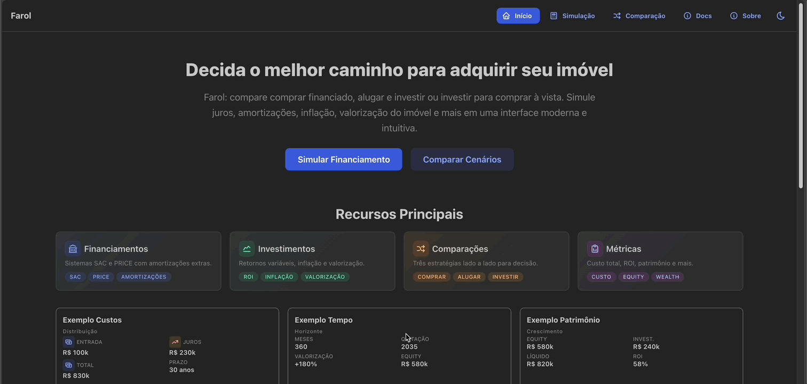

# Farol

Farol é uma plataforma de simulação e planejamento financeiro pessoal, com foco inicial em cenários imobiliários no Brasil.

Disponível em: [Aplicação Web](https://farol-web.onrender.com/)

> **Atenção**
> Serviço hospedado em plano gratuito. Por ser instância gratuita, ela será suspensa em caso de inatividade, o que pode atrasar a primeira simulação em 50 segundos ou mais. A estabilidade pode variar sem aviso prévio.

Se preferir rodar localmente, há instruções ao longo deste README.

<details open>
<summary><strong>Comprar vs Alugar</strong></summary>

&nbsp;


</details>


## Autor
Wilson Rocha Lacerda Junior – desenvolvedor da biblioteca open source de Aprendizado de Máquina [SysIdentPy](https://github.com/wilsonrljr/sysidentpy).

Redes e contato:
- GitHub: https://github.com/wilsonrljr
- LinkedIn: https://www.linkedin.com/in/wilsonrljr
- ORCID: https://orcid.org/0000-0002-3263-1152

Para conversar: abra uma discussão, issue ou mande um PR. Ideias e feedback são bem-vindos.

## Funcionalidades
- Simulação de financiamentos imobiliários nos sistemas SAC e PRICE.
- Comprar vs Alugar (comparação entre estratégias):
  - Comprar um imóvel com financiamento.
  - Alugar e investir o valor da entrada.
  - Investir até comprar à vista.
- Amortizações extraordinárias configuráveis ao longo do tempo.
 - Amortizações extraordinárias avançadas: eventos únicos, recorrentes, valores fixos ou % do saldo, ajuste opcional por inflação.
- Múltiplas faixas de retorno de investimento (variação temporal).
- Considera inflação, valorização do imóvel, custos adicionais (ITBI, escritura, condomínio, IPTU, manutenção, seguro e outros recorrentes exclusivos de proprietário/inquilino).
- Resultados detalhados: fluxo de caixa mensal, patrimônio, saldo investido, equity, valor do imóvel.
- Comparação com ledger comum de caixa e passivos, validação de viabilidade e status explícito de comparabilidade.
- Planejamento FIRE em valores reais (dinheiro de hoje), além de reserva de emergência, estresse e veículos.
- Interface web responsiva (React + Mantine).

## Tecnologias
Backend: Python (FastAPI, Pydantic, NumPy, Pandas, Matplotlib)
Frontend: React + Vite + TypeScript + Mantine UI

## Instalação (Dev)
Você pode usar `uv` (recomendado) ou `pip`.

Backend com `uv`:
```bash
uv sync --extra dev
uv run ruff check backend
uv run ruff format --check backend
uv run pytest --cov=backend --cov-report=term-missing -q
uv run uvicorn backend.app.main:app --reload
```

Backend com `pip`:
```bash
pip install -e .[dev]
ruff check backend
ruff format --check backend
pytest --cov=backend --cov-report=term-missing -q
uvicorn backend.app.main:app --reload
```

Gerar/atualizar lock (cria `uv.lock`):
```bash
uv lock
```

Frontend (em outro terminal):
```bash
cd frontend
npm ci
npm run lint
npm run typecheck
npm test
npm run build
npm run dev
```

Frontend: http://localhost:5173

## Executar com Docker

Para Windows, macOS ou Linux, instale o Docker Desktop (ou Docker Engine com o plugin Compose), clone o repositório e execute um dos modos abaixo. O Compose mantém frontend e backend na mesma rede e aplica a configuração correta de comunicação entre eles.

> A variável `VITE_API_BASE` é incorporada pelo Vite ao iniciar o ambiente de desenvolvimento ou durante o build. Passá-la com `docker run -e` para uma imagem já construída não altera o frontend.

### Ambiente de Desenvolvimento (hot reload)
Requisitos: Docker >= 24, Docker Compose Plugin.

Subir (backend com reload + frontend Vite):
```bash
docker compose up --build
```
Endpoints:
- Backend: http://localhost:8000/docs
- Frontend: http://localhost:5173

Parar:
```bash
docker compose down
```

### Ambiente de Produção (build otimizado)
```bash
docker compose -f docker-compose.prod.yml up --build -d
```
Endpoints:
- App: http://localhost:8080
- Backend (rede interna): http://backend:8000
- API para o navegador: `http://localhost:8080/api/*` (proxy same-origin do Nginx)
- Liveness: http://localhost:8080/healthz
- Readiness: http://localhost:8080/readyz

Logs:
```bash
docker compose logs -f
```

Derrubar:
```bash
docker compose -f docker-compose.prod.yml down
```

### Variáveis de Ambiente do Frontend
`VITE_API_BASE` é uma variável de **build do Vite**, não uma configuração de runtime do Nginx. No Compose de produção ela fica vazia: o navegador chama `/api` no mesmo domínio e o Nginx encaminha a requisição ao backend. Isso evita publicar nomes internos como `backend:8000` no JavaScript entregue ao usuário.

Só defina outra origem quando o frontend e a API forem realmente publicados em domínios diferentes; nesse caso, faça um novo build e configure a allowlist CORS do backend:
```bash
docker build -t farol-frontend --build-arg VITE_API_BASE=https://api.exemplo.com -f frontend/Dockerfile .
```

Passar `VITE_API_BASE` com `docker run -e` para uma imagem pronta não funciona, pois os assets já foram compilados.

O backend e o Nginx recusam corpos acima de 4 MiB antes de processar o JSON. Se
`MAX_REQUEST_BODY_BYTES` for alterado em uma implantação sem o Nginx fornecido,
mantenha o limite equivalente no proxy de borda; no Compose oficial ambos usam
4 MiB.

### Makefile (atalhos)
Se disponível:
```bash
make dev      # compose up (build) interativo
make prod     # produção detach
make down     # parar dev
make prod-down
make logs
```

### Limpeza / Rebuild
```bash
docker compose down -v
docker system prune -f
docker compose build --no-cache
```

## Uso
1. Acesse `http://localhost:5173` em desenvolvimento ou `http://localhost:8080` no Compose de produção.
2. Explore:
  - Início: visão geral.
    - Comprar vs Alugar.
  - Sobre: conceitos e metodologia.
    - Docs: documentação detalhada (Quickstart, Cálculos, Glossário).


## Contrato da comparação

- Quando houver principal financiado após entrada + FGTS elegível, informe prazo, sistema e exatamente uma taxa: `annual_interest_rate` **ou** `monthly_interest_rate`. Se a compra não tiver principal financiado, a taxa pode ser omitida e prazo/sistema são opcionais quando `comparison_horizon_years` estiver presente; as duas taxas juntas nunca são aceitas.
- Informe exatamente uma forma de aluguel: `rent_value` **ou** `rent_percentage`. O percentual é **mensal (% a.m.)**; por exemplo, `0,5` sobre R$ 500.000 resulta em R$ 2.500 no primeiro mês.
- `comparison_horizon_years` define quando os patrimônios são comparados, independentemente de `loan_term_years`.
- `total_savings` representa o dinheiro disponível no início e precisa cobrir entrada mais custos upfront. Para um ranking autoritativo também é necessário `monthly_plan`.
- `monthly_plan` informa salário líquido, gastos fora da moradia, correção pela inflação, percentual da sobra destinado ao patrimônio e, na compra financiada, a divisão entre investir e amortizar.
- A mesma regra mensal é aplicada às três estratégias. A parte não alocada fica fora da simulação; a falta para gastos obrigatórios vira `total_unfunded_amount`/`final_liabilities` e nunca é convertida em patrimônio.
- No cenário `invest_buy`, a compra usa investimento líquido + FGTS elegível. Não existe caixa residual implícito.
- O campo `comparison_status` informa se é válido eleger um vencedor: `comparable`, `exploratory`, `incomparable` ou `no_feasible_scenario`. `best_scenario` e `best_scenario_type` ficam nulos fora de `comparable`.
- `roi_percentage` e `roi_including_withdrawals_percentage` são atualmente nulos (`N.D.` na interface). Um ROI agregado só será publicado quando houver série de fluxos suficiente para TWR/XIRR.
- Use `scenario_type` (`buy`, `rent_invest`, `invest_buy`) como identificador estável; os nomes visíveis podem ser traduzidos.

## Exportação de Resultados
É possível exportar dados das simulações e comparações em CSV ou XLSX.

## Documentação Detalhada
Rotas no frontend em `/docs/*`:

| Página | URL | Conteúdo |
|--------|-----|----------|
| Quickstart | `/docs/quickstart` | Passo a passo mínimo de uso e leitura rápida das métricas. |
| Cálculos | `/docs/calculos` | Fórmulas e decisões de modelagem (PRICE/SAC, inflação, ledger e sustentabilidade). |
| Glossário | `/docs/glossario` | Definições de campos de entrada, saídas mensais e métricas agregadas. |

Arquivos fonte correspondentes em `docs/quickstart.md`, `docs/calculations.md`, `docs/glossary.md`.

## Amortizações Extra Avançadas

É possível modelar aportes de redução de saldo de forma muito mais flexível:

### Formato (Backend `AmortizationInput`)
| Campo | Tipo | Descrição |
|-------|------|-----------|
| `month` | int? | Mês do primeiro evento (ou único). Default 1 se recorrente sem especificação. |
| `value` | float | Valor fixo em moeda ou percentual (quando `value_type=percentage`). |
| `value_type` | `"fixed" | "percentage"` | Interpretação do `value`. Default `fixed`. |
| `interval_months` | int? | Intervalo entre ocorrências (ex: 12 para anual). Ausente => evento único. |
| `occurrences` | int? | Número de repetições. Alternativa a `end_month`. |
| `end_month` | int? | Último mês (inclusivo) da recorrência. Ignorado se `occurrences` informado. |
| `inflation_adjust` | bool | Se `true`, valores fixos são corrigidos pela inflação a partir do mês inicial da série. |

### Estratégias Possíveis
- Bônus anual de fim de ano: `interval_months=12`.
- Aporte semestral variável ao saldo: `%` a cada 6 meses.
- Combinação de aporte fixo + percentual no mesmo mês.
- Série limitada por número de ocorrências (ex: 3 bônus) ou até um mês limite (ex: até mês 60).

### Efeito na Simulação
Os aportes extras reduzem o saldo devedor, encurtando prazo (SAC/PRICE) e diminuindo juros totais. Percentuais se adaptam ao saldo residual, mantendo estratégia proporcional ao tempo. Valores inflacionados preservam poder real do aporte.


## Licença
Este projeto está licenciado sob a **GNU Affero General Public License v3 (AGPL-3.0)**.

Copyright © 2025 Wilson Rocha Lacerda Junior.
